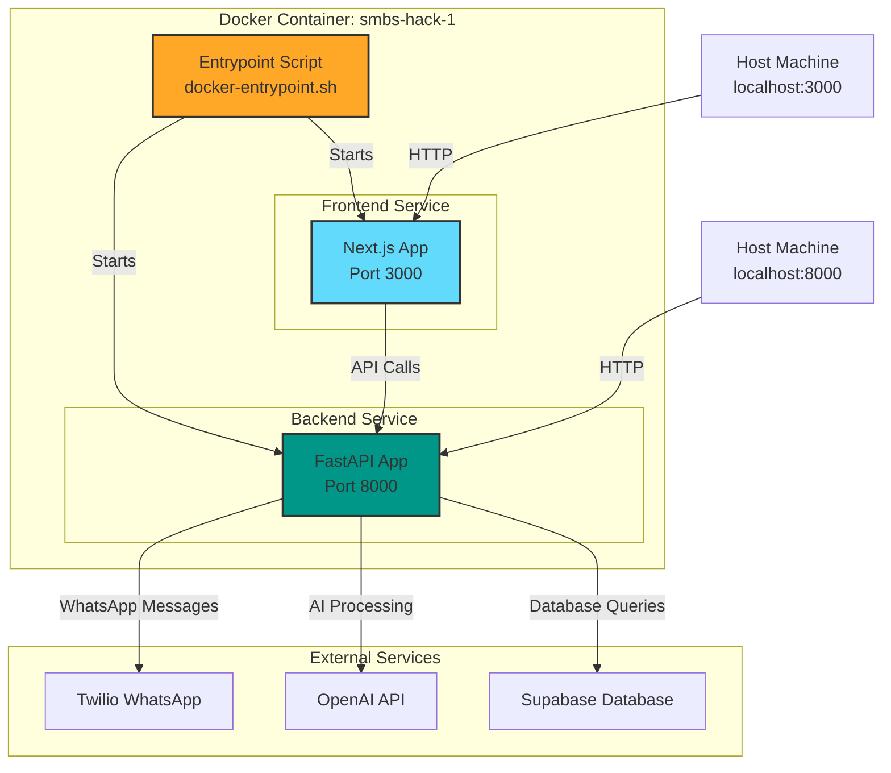
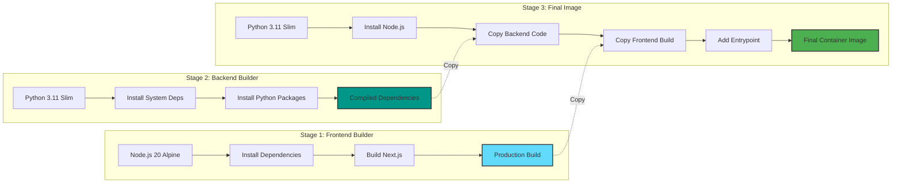
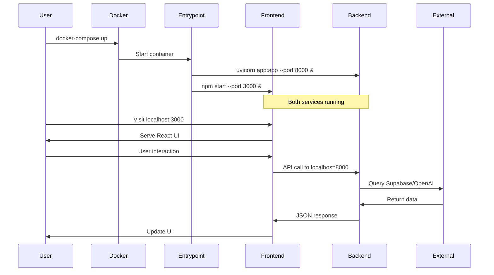
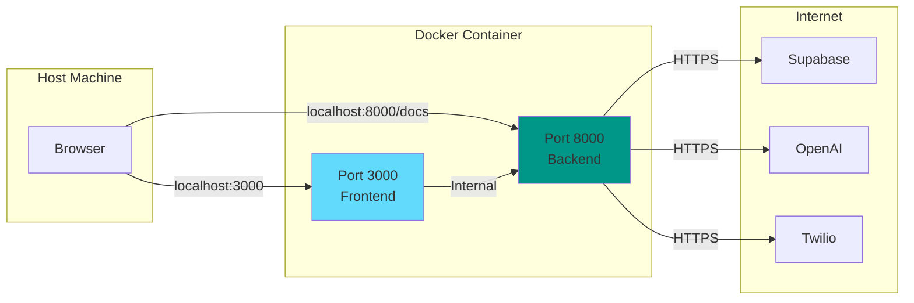
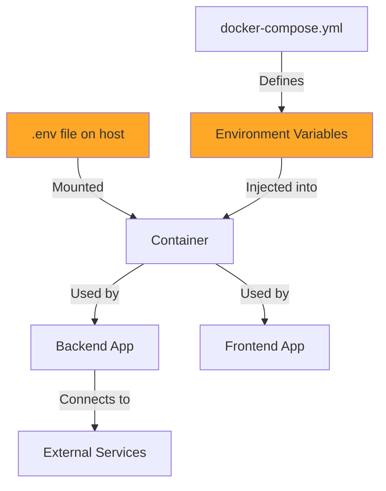
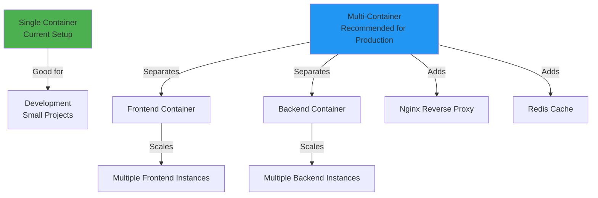
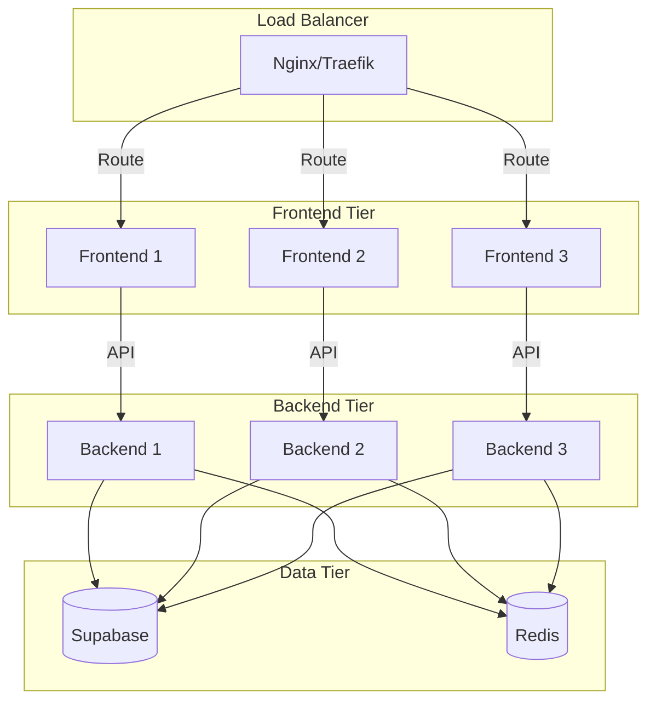

# Docker Architecture Overview

## 📊 Container Architecture



## 🏗️ Build Process



## 🔄 Runtime Flow



## 📦 File Structure in Container

```
/app/
├── backend/
│   └── app/
│       ├── app.py
│       ├── services/
│       ├── integrations/
│       ├── workflows/
│       └── .env
├── frontend/
│   ├── .next/              (built files)
│   ├── public/
│   ├── node_modules/
│   └── package.json
└── docker-entrypoint.sh
```

## 🌐 Network Flow



## 🔐 Environment Variables Flow



## 🚀 Deployment Options



## 📈 Scaling Strategy

For production, consider this architecture:


