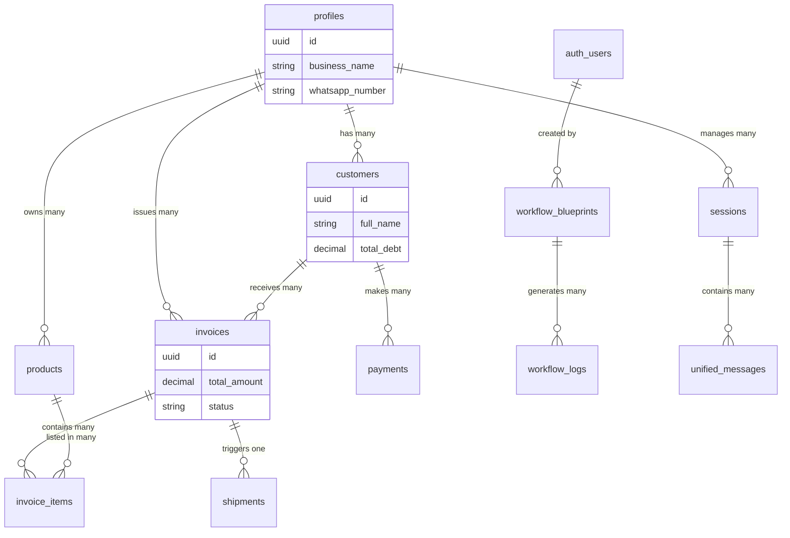

# Database Documentation

## 1. Overview

The database is hosted on **Supabase** (PostgreSQL). It manages user profiles, business data (customers, products, invoices), and the entire automation engine state (workflows, logs, sessions).

## 2. Schema Relationship Diagram (ERD)

## 3. Core Tables

### Business Entity Tables

These tables sort the core ERP-like data for the user's business.

- **`profiles`**: The central entity representing the business owner. Contains `business_name`, `gst_number`, and `whatsapp_number`.
- **`customers`**: Stores client details (`full_name`, `phone_number`) and their current `total_debt`.
- **`products`**: Inventory items. Tracks `current_stock` and `base_price`.
- **`invoices`**: Financial records linked to a customer. Status can be 'pending', 'active', etc.
- **`invoice_items`**: Line items for each invoice, linking `products` to `invoices`.
- **`payments`**: Records of money received (`amount_received`, `payment_mode`).
- **`shipments`**: Tracks logistics for invoices via Shiprocket (`awb_number`, `status`).

### Automation & Chat Tables

These tables power the AI agents and workflow engine.

- **`sessions`**: Represents an active conversation context with a user on a specific platform (e.g., WhatsApp). Determine if the bot is active (`is_bot_active`).
- **`unified_messages`**: A unified log of all chat history across platforms. Stores `content`, `direction` (inbound/outbound), and `status`.
- **`workflow_blueprints`**: Stores the JSON graph of the automation logic (`nodes`, `edges`). Created by the `WorkflowArchitect`.
- **`workflow_logs`**: detailed execution history. Every step of a workflow run is logged here in `step_results` (JSON), allowing for real-time monitoring on the frontend.

## 4. Information Flow

### Chat Flow

1.  **Incoming Message**: Webhook triggers -> Finds/Creates `sessions` entry -> Logs to `unified_messages` (inbound).
2.  **Processing**: AI Agent reads history -> Decides action -> Logs response to `unified_messages` (outbound).

### Workflow Flow

1.  **Drafting**: User prompts -> Architect creates `workflow_blueprints` entry.
2.  **Execution**: Trigger event -> Engine creates `workflow_logs` entry (status: 'running').
3.  **Step Updates**: Each executed node updates the `step_results` JSON in `workflow_logs`.
4.  **Completion**: Engine updates `workflow_logs` status to 'completed' or 'failed'.
