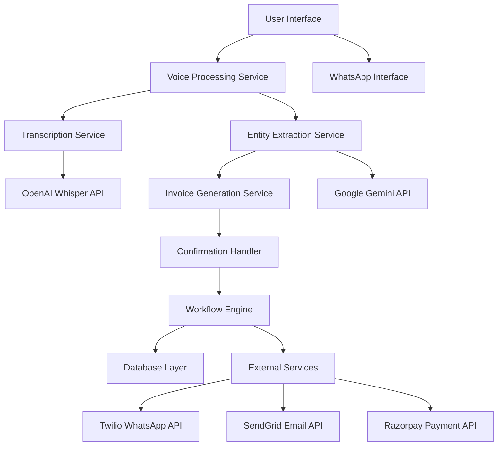
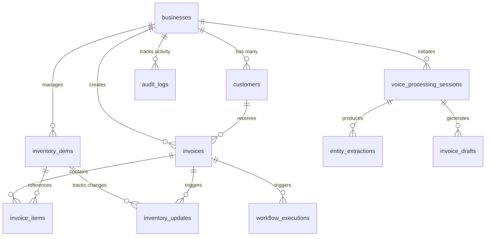

# Design Document: Voice-First Invoice Creation

## Overview

The Voice-First Invoice Creation feature enables small business owners to create invoices through natural voice commands in multiple Indian languages. The system leverages OpenAI Whisper for speech-to-text transcription, Google Gemini for entity extraction, and provides a human-in-the-loop confirmation process before executing automated workflows. The feature supports both web dashboard and WhatsApp interfaces, ensuring accessibility across different user preferences and technical capabilities.

## Architecture

The system follows a microservices architecture with clear separation of concerns:



### Key Architectural Principles

1. **Async Processing**: All AI API calls are handled asynchronously to prevent blocking
2. **Fault Tolerance**: Comprehensive error handling with fallback mechanisms
3. **Scalability**: Stateless services that can scale horizontally
4. **Observability**: Full logging and monitoring integration
5. **Security**: API key management and data encryption

## Components and Interfaces

### Voice Processing Service

**Responsibilities:**
- Audio capture and validation
- Real-time recording status updates
- Audio file management and cleanup

**Interface:**
```javascript
class VoiceProcessingService {
  async startRecording() {
    // Returns: { id, startTime, maxDuration, status }
  }
  
  async stopRecording(sessionId) {
    // Returns: { id, url, duration, format, size }
  }
  
  getRecordingStatus(sessionId) {
    // Returns: { status: 'recording' | 'stopped' | 'error' }
  }
  
  validateAudioFile(file) {
    // Returns: { isValid, errors }
  }
}
```

### Transcription Service

**Responsibilities:**
- Integration with OpenAI Whisper API
- Language detection and handling
- Confidence scoring and quality assessment

**Interface:**
```javascript
class TranscriptionService {
  async transcribe(audioFile, language = null) {
    // Returns: { text, confidence, language, segments, processingTime }
  }
  
  async detectLanguage(audioFile) {
    // Returns: { language, confidence }
  }
  
  validateTranscription(result) {
    // Returns: { isValid, errors }
  }
}
```

### Entity Extraction Service

**Responsibilities:**
- Business entity identification using Gemini LLM
- Data validation and normalization
- Confidence assessment and error handling

**Interface:**
```javascript
class EntityExtractionService {
  async extractEntities(transcript) {
    // Returns: { customer, items, metadata, confidence }
  }
  
  validateExtraction(result) {
    // Returns: { isValid, errors }
  }
  
  requestClarification(missingFields) {
    // Returns: { questions, format }
  }
}
```

### Invoice Generation Service

**Responsibilities:**
- Draft invoice creation and formatting
- Tax calculations (GST, IGST, CGST, SGST)
- PDF generation and preview

**Interface:**
```javascript
class InvoiceGenerationService {
  async generateDraft(extractionResult) {
    // Returns: { id, customer, items, subtotal, taxes, total, dueDate, status }
  }
  
  calculateTaxes(items, customerState) {
    // Returns: { cgst, sgst, igst, totalTax }
  }
  
  async generatePDF(invoice) {
    // Returns: { pdfUrl, size }
  }
  
  validateDraft(draft) {
    // Returns: { isValid, errors }
  }
}
```

### Confirmation Handler

**Responsibilities:**
- User confirmation workflow management
- Draft editing and modification
- Timeout handling and draft persistence

**Interface:**
```javascript
class ConfirmationHandler {
  async presentDraft(draft) {
    // Returns: { id, draft, expiresAt, options }
  }
  
  async handleConfirmation(requestId, action) {
    // Returns: { success, result, nextStep }
  }
  
  async editDraft(draftId, modifications) {
    // Returns: updated draft object
  }
  
  async saveDraftForLater(draftId) {
    // Returns: { saved: true, retrievalId }
  }
}
```

### Workflow Engine

**Responsibilities:**
- Automated workflow execution after confirmation
- Inventory updates and transaction logging
- Multi-channel communication (WhatsApp, Email)

**Interface:**
```javascript
class WorkflowEngine {
  async executeInvoiceCreation(confirmedDraft) {
    // Returns: { invoice, inventoryUpdates, deliveryResults, executionTime, status }
  }
  
  async updateInventory(items) {
    // Returns: array of inventory update records
  }
  
  async sendInvoiceToCustomer(invoice, channels) {
    // Returns: { whatsapp: {sent, messageId}, email: {sent, messageId} }
  }
  
  async logTransaction(invoice) {
    // Returns: { logged: true, transactionId }
  }
}
```

## Database Structure

### Core Database Tables

**businesses**
```sql
CREATE TABLE businesses (
  id UUID PRIMARY KEY DEFAULT gen_random_uuid(),
  business_name VARCHAR(255) NOT NULL,
  owner_name VARCHAR(255) NOT NULL,
  gst_number VARCHAR(15),
  address_street VARCHAR(255),
  address_city VARCHAR(100),
  address_state VARCHAR(100),
  address_postal_code VARCHAR(10),
  address_country VARCHAR(100) DEFAULT 'India',
  default_currency VARCHAR(3) DEFAULT 'INR',
  default_language VARCHAR(5) DEFAULT 'en',
  invoice_prefix VARCHAR(10) DEFAULT 'INV',
  default_tax_rate DECIMAL(5,2) DEFAULT 18.00,
  enable_gst BOOLEAN DEFAULT true,
  business_state VARCHAR(100),
  tax_registration_number VARCHAR(50),
  created_at TIMESTAMP DEFAULT CURRENT_TIMESTAMP,
  updated_at TIMESTAMP DEFAULT CURRENT_TIMESTAMP
);
```

**customers**
```sql
CREATE TABLE customers (
  id UUID PRIMARY KEY DEFAULT gen_random_uuid(),
  business_id UUID REFERENCES businesses(id) ON DELETE CASCADE,
  name VARCHAR(255) NOT NULL,
  phone VARCHAR(20),
  email VARCHAR(255),
  address_street VARCHAR(255),
  address_city VARCHAR(100),
  address_state VARCHAR(100),
  address_postal_code VARCHAR(10),
  gst_number VARCHAR(15),
  is_active BOOLEAN DEFAULT true,
  created_at TIMESTAMP DEFAULT CURRENT_TIMESTAMP,
  updated_at TIMESTAMP DEFAULT CURRENT_TIMESTAMP
);
```

**invoices**
```sql
CREATE TABLE invoices (
  id UUID PRIMARY KEY DEFAULT gen_random_uuid(),
  invoice_number VARCHAR(50) UNIQUE NOT NULL,
  business_id UUID REFERENCES businesses(id) ON DELETE CASCADE,
  customer_id UUID REFERENCES customers(id),
  subtotal DECIMAL(12,2) NOT NULL,
  cgst DECIMAL(12,2) DEFAULT 0,
  sgst DECIMAL(12,2) DEFAULT 0,
  igst DECIMAL(12,2) DEFAULT 0,
  total_tax DECIMAL(12,2) DEFAULT 0,
  total DECIMAL(12,2) NOT NULL,
  currency VARCHAR(3) DEFAULT 'INR',
  issue_date DATE NOT NULL,
  due_date DATE NOT NULL,
  status VARCHAR(20) DEFAULT 'draft' CHECK (status IN ('draft', 'sent', 'viewed', 'paid', 'overdue', 'cancelled')),
  payment_status VARCHAR(20) DEFAULT 'pending' CHECK (payment_status IN ('pending', 'partial', 'paid', 'failed', 'refunded')),
  creation_method VARCHAR(20) DEFAULT 'manual' CHECK (creation_method IN ('voice', 'manual', 'import')),
  original_transcript TEXT,
  processing_time INTEGER,
  language VARCHAR(5),
  confidence DECIMAL(3,2),
  created_by UUID,
  created_at TIMESTAMP DEFAULT CURRENT_TIMESTAMP,
  updated_at TIMESTAMP DEFAULT CURRENT_TIMESTAMP
);
```

**invoice_items**
```sql
CREATE TABLE invoice_items (
  id UUID PRIMARY KEY DEFAULT gen_random_uuid(),
  invoice_id UUID REFERENCES invoices(id) ON DELETE CASCADE,
  inventory_item_id UUID REFERENCES inventory_items(id),
  name VARCHAR(255) NOT NULL,
  description TEXT,
  quantity DECIMAL(10,3) NOT NULL,
  unit VARCHAR(20) NOT NULL,
  unit_price DECIMAL(10,2) NOT NULL,
  total_price DECIMAL(12,2) NOT NULL,
  tax_rate DECIMAL(5,2) DEFAULT 18.00,
  created_at TIMESTAMP DEFAULT CURRENT_TIMESTAMP
);
```

**inventory_items**
```sql
CREATE TABLE inventory_items (
  id UUID PRIMARY KEY DEFAULT gen_random_uuid(),
  business_id UUID REFERENCES businesses(id) ON DELETE CASCADE,
  name VARCHAR(255) NOT NULL,
  description TEXT,
  sku VARCHAR(100),
  category VARCHAR(100),
  unit VARCHAR(20) NOT NULL,
  current_stock DECIMAL(10,3) DEFAULT 0,
  min_stock_level DECIMAL(10,3) DEFAULT 0,
  unit_price DECIMAL(10,2) NOT NULL,
  tax_rate DECIMAL(5,2) DEFAULT 18.00,
  is_active BOOLEAN DEFAULT true,
  created_at TIMESTAMP DEFAULT CURRENT_TIMESTAMP,
  updated_at TIMESTAMP DEFAULT CURRENT_TIMESTAMP
);
```

**inventory_updates**
```sql
CREATE TABLE inventory_updates (
  id UUID PRIMARY KEY DEFAULT gen_random_uuid(),
  inventory_item_id UUID REFERENCES inventory_items(id) ON DELETE CASCADE,
  previous_stock DECIMAL(10,3) NOT NULL,
  new_stock DECIMAL(10,3) NOT NULL,
  change_amount DECIMAL(10,3) NOT NULL,
  reason VARCHAR(100) NOT NULL,
  invoice_id UUID REFERENCES invoices(id),
  created_at TIMESTAMP DEFAULT CURRENT_TIMESTAMP
);
```

**voice_processing_sessions**
```sql
CREATE TABLE voice_processing_sessions (
  id UUID PRIMARY KEY DEFAULT gen_random_uuid(),
  business_id UUID REFERENCES businesses(id) ON DELETE CASCADE,
  user_id UUID,
  audio_file_url VARCHAR(500),
  audio_duration INTEGER,
  audio_format VARCHAR(10),
  audio_size INTEGER,
  transcript TEXT,
  transcript_confidence DECIMAL(3,2),
  detected_language VARCHAR(5),
  processing_time INTEGER,
  status VARCHAR(20) DEFAULT 'processing' CHECK (status IN ('processing', 'completed', 'failed')),
  error_message TEXT,
  created_at TIMESTAMP DEFAULT CURRENT_TIMESTAMP,
  updated_at TIMESTAMP DEFAULT CURRENT_TIMESTAMP
);
```

**entity_extractions**
```sql
CREATE TABLE entity_extractions (
  id UUID PRIMARY KEY DEFAULT gen_random_uuid(),
  session_id UUID REFERENCES voice_processing_sessions(id) ON DELETE CASCADE,
  extracted_data JSONB NOT NULL,
  confidence DECIMAL(3,2),
  extraction_time INTEGER,
  validation_errors JSONB,
  status VARCHAR(20) DEFAULT 'pending' CHECK (status IN ('pending', 'completed', 'failed')),
  created_at TIMESTAMP DEFAULT CURRENT_TIMESTAMP
);
```

**invoice_drafts**
```sql
CREATE TABLE invoice_drafts (
  id UUID PRIMARY KEY DEFAULT gen_random_uuid(),
  business_id UUID REFERENCES businesses(id) ON DELETE CASCADE,
  session_id UUID REFERENCES voice_processing_sessions(id),
  customer_data JSONB NOT NULL,
  items_data JSONB NOT NULL,
  subtotal DECIMAL(12,2) NOT NULL,
  taxes JSONB NOT NULL,
  total DECIMAL(12,2) NOT NULL,
  due_date DATE,
  status VARCHAR(20) DEFAULT 'draft' CHECK (status IN ('draft', 'confirmed', 'cancelled', 'expired')),
  expires_at TIMESTAMP,
  created_at TIMESTAMP DEFAULT CURRENT_TIMESTAMP,
  updated_at TIMESTAMP DEFAULT CURRENT_TIMESTAMP
);
```

**workflow_executions**
```sql
CREATE TABLE workflow_executions (
  id UUID PRIMARY KEY DEFAULT gen_random_uuid(),
  workflow_type VARCHAR(50) NOT NULL,
  triggered_by UUID,
  invoice_id UUID REFERENCES invoices(id),
  status VARCHAR(20) DEFAULT 'pending' CHECK (status IN ('pending', 'running', 'completed', 'failed')),
  steps JSONB,
  start_time TIMESTAMP DEFAULT CURRENT_TIMESTAMP,
  end_time TIMESTAMP,
  execution_time INTEGER,
  error_message TEXT,
  created_at TIMESTAMP DEFAULT CURRENT_TIMESTAMP
);
```

**audit_logs**
```sql
CREATE TABLE audit_logs (
  id UUID PRIMARY KEY DEFAULT gen_random_uuid(),
  business_id UUID REFERENCES businesses(id) ON DELETE CASCADE,
  user_id UUID,
  action VARCHAR(100) NOT NULL,
  resource_type VARCHAR(50) NOT NULL,
  resource_id UUID,
  old_values JSONB,
  new_values JSONB,
  ip_address INET,
  user_agent TEXT,
  created_at TIMESTAMP DEFAULT CURRENT_TIMESTAMP
);
```

### Database Indexes

```sql
-- Performance indexes
CREATE INDEX idx_invoices_business_id ON invoices(business_id);
CREATE INDEX idx_invoices_customer_id ON invoices(customer_id);
CREATE INDEX idx_invoices_status ON invoices(status);
CREATE INDEX idx_invoices_payment_status ON invoices(payment_status);
CREATE INDEX idx_invoices_due_date ON invoices(due_date);
CREATE INDEX idx_invoices_created_at ON invoices(created_at);

CREATE INDEX idx_customers_business_id ON customers(business_id);
CREATE INDEX idx_customers_phone ON customers(phone);
CREATE INDEX idx_customers_email ON customers(email);

CREATE INDEX idx_inventory_items_business_id ON inventory_items(business_id);
CREATE INDEX idx_inventory_items_category ON inventory_items(category);
CREATE INDEX idx_inventory_items_sku ON inventory_items(sku);

CREATE INDEX idx_voice_sessions_business_id ON voice_processing_sessions(business_id);
CREATE INDEX idx_voice_sessions_status ON voice_processing_sessions(status);
CREATE INDEX idx_voice_sessions_created_at ON voice_processing_sessions(created_at);

-- JSONB indexes for efficient querying
CREATE INDEX idx_entity_extractions_data ON entity_extractions USING GIN (extracted_data);
CREATE INDEX idx_invoice_drafts_customer ON invoice_drafts USING GIN (customer_data);
CREATE INDEX idx_workflow_steps ON workflow_executions USING GIN (steps);
```

### Database Relationships



## Correctness Properties

*A property is a characteristic or behavior that should hold true across all valid executions of a system—essentially, a formal statement about what the system should do. Properties serve as the bridge between human-readable specifications and machine-verifiable correctness guarantees.*

<function_calls>
<invoke name="prework">
<parameter name="featureName">voice-first-invoice-creation

### Property Reflection

After analyzing all acceptance criteria, I identified several areas where properties can be consolidated to eliminate redundancy:

**Consolidation Opportunities:**
- Properties 1.1-1.7 (Voice Processing) can be grouped into comprehensive voice processing properties
- Properties 2.1-2.7 (Entity Extraction) can be consolidated into entity extraction and validation properties  
- Properties 3.1-3.7 (Invoice Generation) can be combined into draft generation and calculation properties
- Properties 4.1-4.7 (Confirmation) can be merged into confirmation workflow properties
- Properties 5.1-5.7 (Workflow Engine) can be consolidated into workflow execution properties
- Properties 6.2-6.7 (Multi-channel) can be combined into interface consistency properties
- Properties 7.1-7.7 (Error Handling) can be merged into error handling and recovery properties
- Properties 8.1-8.5 (Performance) can be consolidated into performance requirement properties

**Final Consolidated Properties:**

Property 1: Voice Processing Workflow
*For any* audio input up to 60 seconds, the voice processor should successfully capture, transcribe, and return results with confidence scores within expected time bounds
**Validates: Requirements 1.1, 1.2, 1.3, 1.4**

Property 2: Multi-language Support
*For any* supported language (Hindi, English, Marathi, Tamil, Telugu, Kannada) or mixed-language input, the voice processor should handle transcription appropriately
**Validates: Requirements 1.6, 1.7**

Property 3: Confidence-based Editing
*For any* transcription result with confidence below 85%, the system should offer manual editing options
**Validates: Requirements 1.5**

Property 4: Entity Extraction and Validation
*For any* transcript containing business information, the entity extractor should identify customer names, items, quantities, and prices, and structure them in standardized format
**Validates: Requirements 2.1, 2.2, 2.3**

Property 5: Extraction Confidence Handling
*For any* entity extraction with confidence below 80% or incomplete data, the system should request clarification or prompt for missing fields
**Validates: Requirements 2.4, 2.6**

Property 6: Indian Localization Support
*For any* transcript containing Indian currency formats and number systems, the entity extractor should handle them correctly and validate against business rules
**Validates: Requirements 2.5, 2.7**

Property 7: Draft Generation and Tax Calculation
*For any* extracted entities, the invoice generator should create a formatted draft with correct GST calculations, due dates, and all required information
**Validates: Requirements 3.1, 3.2, 3.3, 3.4**

Property 8: Draft Editing and Recalculation
*For any* draft modifications, the invoice generator should allow editing and automatically recalculate totals while presenting confirmation options
**Validates: Requirements 3.5, 3.6, 3.7**

Property 9: Confirmation Workflow Management
*For any* draft presentation, the confirmation handler should display options, handle user responses appropriately, and maintain state during editing sessions
**Validates: Requirements 4.1, 4.2, 4.3, 4.4, 4.5**

Property 10: Timeout and Audit Handling
*For any* confirmation session, the system should handle timeouts by saving drafts and log all decisions for audit purposes
**Validates: Requirements 4.6, 4.7**

Property 11: Invoice Creation Workflow
*For any* confirmed draft, the workflow engine should create unique invoice records, generate PDFs, and execute multi-channel delivery
**Validates: Requirements 5.1, 5.2, 5.3, 5.4**

Property 12: Inventory and Transaction Management
*For any* completed invoice, the workflow engine should update inventory quantities, log transactions, and notify users of completion
**Validates: Requirements 5.5, 5.6, 5.7**

Property 13: Interface Consistency
*For any* voice processing operation, the system should maintain consistent functionality across web dashboard and WhatsApp interfaces
**Validates: Requirements 6.2, 6.3, 6.4**

Property 14: State Persistence and Offline Handling
*For any* interface switch or offline scenario, the system should preserve draft state and queue messages for later processing
**Validates: Requirements 6.5, 6.6, 6.7**

Property 15: Error Handling and Recovery
*For any* system error (transcription, extraction, or API failures), the system should provide fallback options, queue for retry, and display user-friendly messages
**Validates: Requirements 7.1, 7.2, 7.3, 7.4**

Property 16: Progress Persistence and Monitoring
*For any* error scenario or partial completion, the system should save progress, log to Sentry, and provide clear recovery steps
**Validates: Requirements 7.5, 7.6, 7.7**

Property 17: Performance Requirements
*For any* voice processing workflow, the system should complete transcription within 10 seconds, entity extraction within 5 seconds, draft generation within 3 seconds, and total workflow within 15 seconds
**Validates: Requirements 8.1, 8.2, 8.3, 8.4**

Property 18: Concurrency Handling
*For any* concurrent voice processing requests from multiple users, the system should handle them without interference or performance degradation
**Validates: Requirements 8.5**

## Error Handling

### Error Categories and Recovery Strategies

**1. Audio Processing Errors**
- **Capture Failures**: Hardware/permission issues → Fallback to text input
- **Format Issues**: Unsupported audio formats → Convert or request re-recording
- **Size Limits**: Files too large → Compress or split audio

**2. Transcription Errors**
- **API Failures**: Whisper API unavailable → Queue for retry, offer manual input
- **Low Confidence**: Accuracy below threshold → Manual editing interface
- **Language Detection**: Unsupported language → Request language selection

**3. Entity Extraction Errors**
- **Parsing Failures**: Gemini API issues → Structured input form fallback
- **Incomplete Data**: Missing required fields → Interactive clarification prompts
- **Validation Errors**: Business rule violations → Error messages with correction guidance

**4. Workflow Execution Errors**
- **Database Errors**: Connection/constraint issues → Retry with exponential backoff
- **External API Failures**: Payment/messaging services → Queue for retry, notify user
- **Inventory Conflicts**: Stock unavailable → Warning with override option

### Error Monitoring and Alerting

```javascript
class ErrorHandlingStrategy {
  constructor(category, severity, retryPolicy, fallbackAction, userNotification, monitoringTags) {
    this.category = category;
    this.severity = severity; // 'low' | 'medium' | 'high' | 'critical'
    this.retryPolicy = retryPolicy;
    this.fallbackAction = fallbackAction;
    this.userNotification = userNotification;
    this.monitoringTags = monitoringTags;
  }
}

class RetryPolicy {
  constructor(maxAttempts, backoffStrategy, baseDelay, maxDelay) {
    this.maxAttempts = maxAttempts;
    this.backoffStrategy = backoffStrategy; // 'linear' | 'exponential'
    this.baseDelay = baseDelay;
    this.maxDelay = maxDelay;
  }
}
```

## Testing Strategy

### Dual Testing Approach

The system requires both unit testing and property-based testing to ensure comprehensive coverage:

**Unit Tests:**
- Specific examples and edge cases
- Integration points between components  
- Error conditions and recovery scenarios
- API contract validation

**Property-Based Tests:**
- Universal properties across all inputs
- Comprehensive input coverage through randomization
- Minimum 100 iterations per property test
- Each test tagged with feature and property reference

### Property-Based Testing Configuration

**Testing Framework:** Fast-check (JavaScript)
**Test Configuration:**
- Minimum 100 iterations per property test
- Custom generators for business domain objects
- Shrinking enabled for minimal counterexamples
- Timeout: 30 seconds per property test

**Test Tagging Format:**
```javascript
// Feature: voice-first-invoice-creation, Property 1: Voice Processing Workflow
test('voice processing workflow property', async () => {
  await fc.assert(fc.asyncProperty(
    audioInputGenerator(),
    async (audioInput) => {
      // Property test implementation
    }
  ), { numRuns: 100 })
})
```

### Test Data Generators

**Custom Generators for Domain Objects:**
```javascript
const audioInputGenerator = () => fc.record({
  duration: fc.integer({ min: 3, max: 60 }),
  format: fc.constantFrom('wav', 'mp3', 'ogg'),
  language: fc.constantFrom('hi', 'en', 'mr', 'ta', 'te', 'kn'),
  quality: fc.constantFrom('low', 'medium', 'high')
})

const transcriptGenerator = () => fc.record({
  text: fc.string({ minLength: 10, maxLength: 500 }),
  confidence: fc.float({ min: 0, max: 1 }),
  language: fc.constantFrom('hi', 'en', 'mr', 'ta', 'te', 'kn')
})

const businessEntityGenerator = () => fc.record({
  customerName: fc.string({ minLength: 2, maxLength: 50 }),
  items: fc.array(invoiceItemGenerator(), { minLength: 1, maxLength: 10 }),
  currency: fc.constant('INR')
})
```

### Integration Testing

**API Integration Tests:**
- OpenAI Whisper API contract validation
- Google Gemini API response handling
- Twilio WhatsApp webhook processing
- Supabase database operations

**End-to-End Testing:**
- Complete voice-to-invoice workflow
- Multi-channel delivery verification
- Error recovery scenarios
- Performance benchmarking

### Performance Testing

**Load Testing Scenarios:**
- Concurrent voice processing (10-100 users)
- Peak usage simulation (1000+ requests/minute)
- Long-running workflow execution
- Database connection pooling under load

**Performance Benchmarks:**
- Voice transcription: < 10 seconds for 60-second audio
- Entity extraction: < 5 seconds per transcript
- Draft generation: < 3 seconds per extraction
- End-to-end workflow: < 15 seconds total